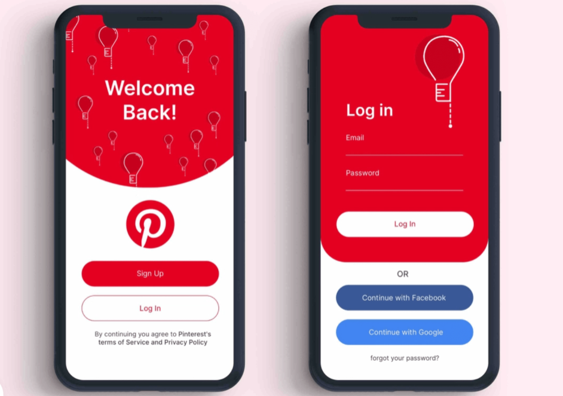

# **Projeto Welcome**  
Clone de app usando HTML, CSS e JS.

______________________

## Referência:

  

## Informações:

Esse projeto foi uma proposta de treino.  

Melhoras que obtive:  
* Familiaridade maior com algumas tags do html
* Visão dos elementos CSS
* Grid
* Modularização
* Animação básica
* Markdown
* Git

## Sobre mim:

Meu nome é Davi. Estudo programação desde janeiro de 2023 e estou em transição de carreira.  

[LinkedIn](https://www.linkedin.com/in/davicastanhaescribano/)

